## Welkom!

note:
- voorstelling lector
- situering vak
- vraag voor de groep: wie heeft al VR gebruikt, beschikt iemand over eigen headset?

---

## [studiewijzer](https://ects.ap.be/ects/opleidings-onderdeel/242417)

note:
- "geen volgtijdelijkheid"
  - wel wiskundig vak!
  - wel ervaring 3D game dev
- vak is geen eindpunt: AR in het tweede semester
- slides gelinkt op DigitAP
  - kent heel de groep Git?

---

## Aanpak

- [boek Lavalle](https://lavalle.pl/vr/)
- [Godot engine](https://godotengine.org/)
  - C♯ in plaats van GDScript
  - OpenXR basis, geen godot-xr-tools*
- [projectbasis](https://www.youtube.com/watch?v=6qZyxAmMBdU&list=PLT26e2jOwbdg&pp=0gcJCbwFa94AFGB0)
- [herimplementatie high-level acties](https://www.youtube.com/@BastiaanOlij/videos)

note:

- voor het labo: zorg dat je eerste filmpje uit de playlist begrijpt
  - je krijgt bij start van het labo C♯-code

---

"Inducing **targeted behavior** in an **organism** by using **artificial sensory stimulation**, while the organism has **little or no awareness** of the interference."

note:

- dit is één definitie en het is geen "wiskundige" definitie

---

## Toepassingen

note:

- uit de groep?
- games
  - ook ander entertainment zoals VR cinema
- training
- visualisatie (architecten, inspecteurs, chirurgen, artiesten,...)
- therapie
- teleoperatie

---

  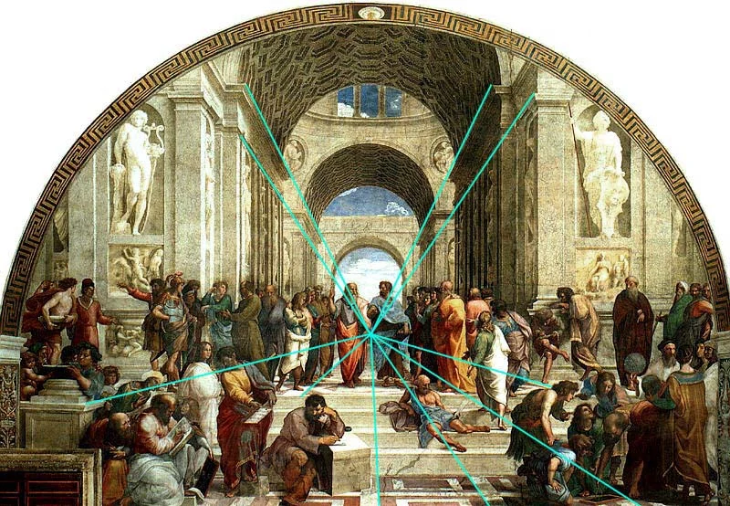<!--Rafael, +- 1510-->
  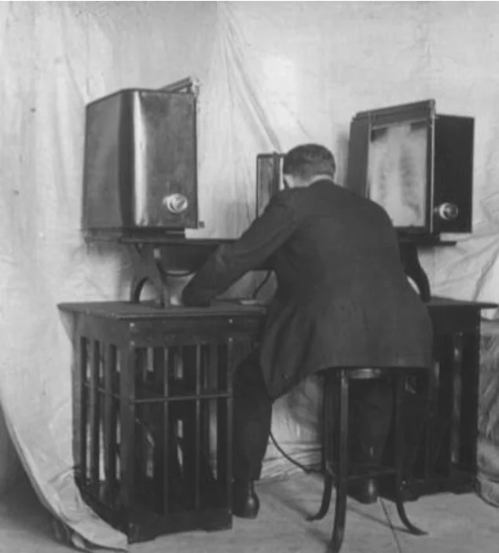<!--Charles Wheatstone, 1838-->

note:
- niet zomaar rijtje van dingen die "ook bestonden"
- eerder: zuivere implementatie van belangrijke technieken
  - of bij Virtual Boy: duidelijke illustratie van wat mis kan gaan

---

  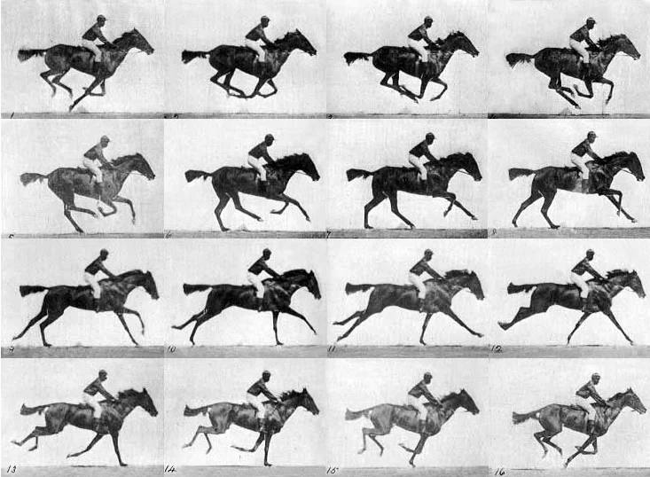<!--Eadwerd Muybridge, 1878-->
  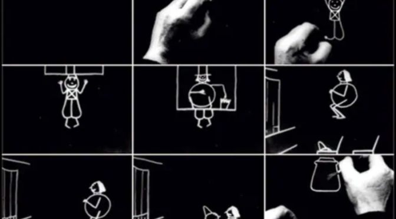<!--Emile Cohl, 1908-->

---

  
  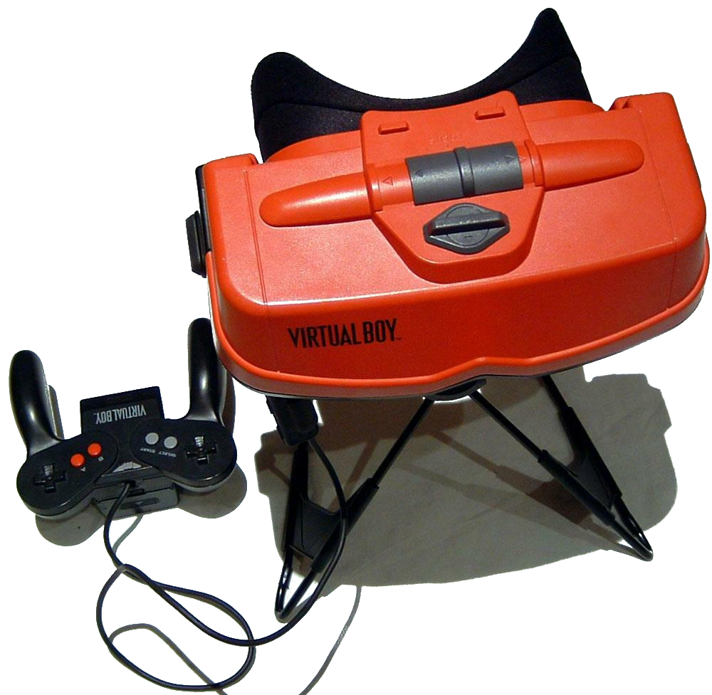

---

## 2 aspecten

note:

- engineering
  - hardware (headsets, maar ook treadmills,...)
  - software (computer graphics, physics,...)
- **reverse** engineering
  - menselijke perceptie
  - menselijke fysiologie
- verleidelijk dat tweede aspect achterwege te laten, maar dan kan VR niet werken
  - lichaam reageert **heel slecht** op slechte VR (misselijkheid, hoofdpijn,...)

---

## Perception of stationarity

  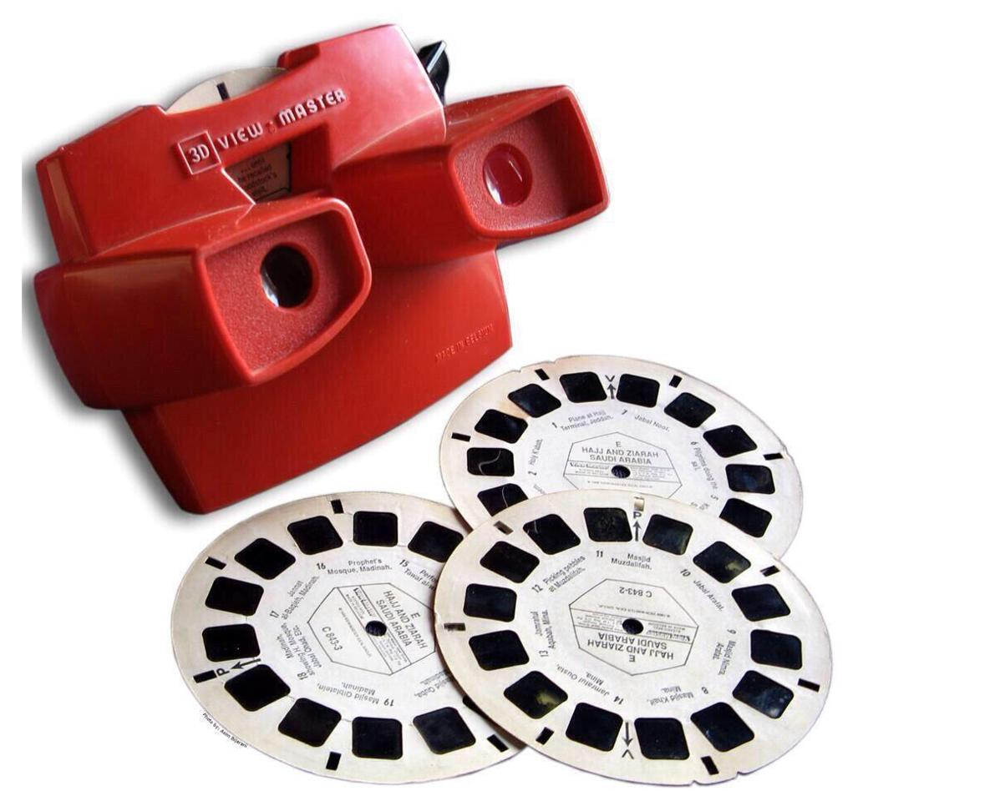
  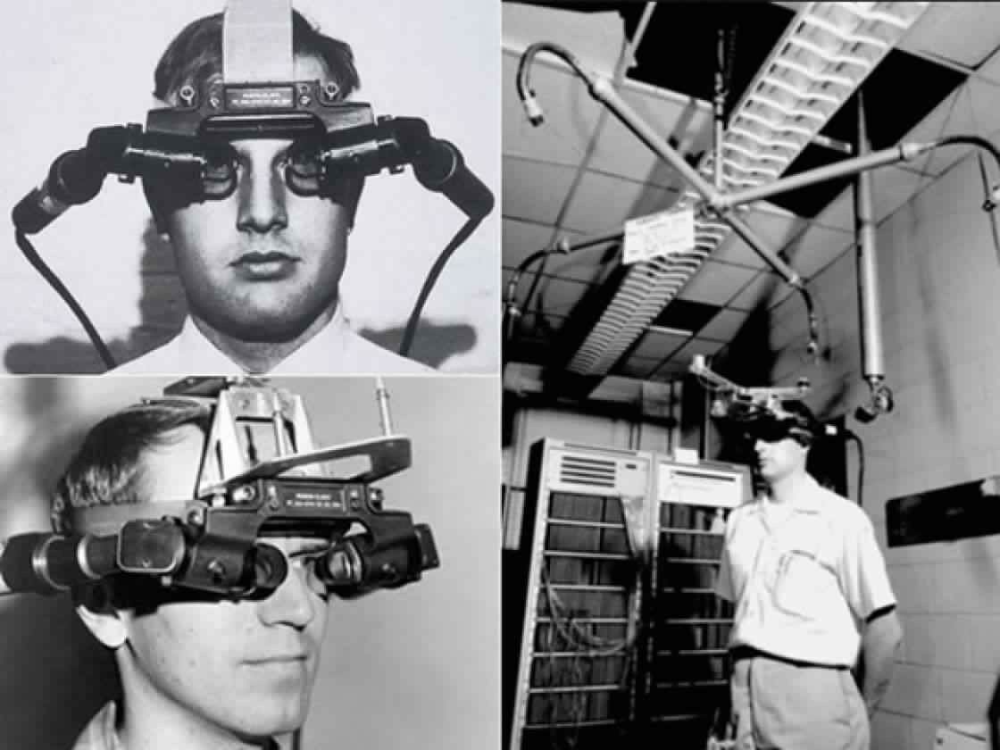<!--Ivan Sutherland, 1968-->
  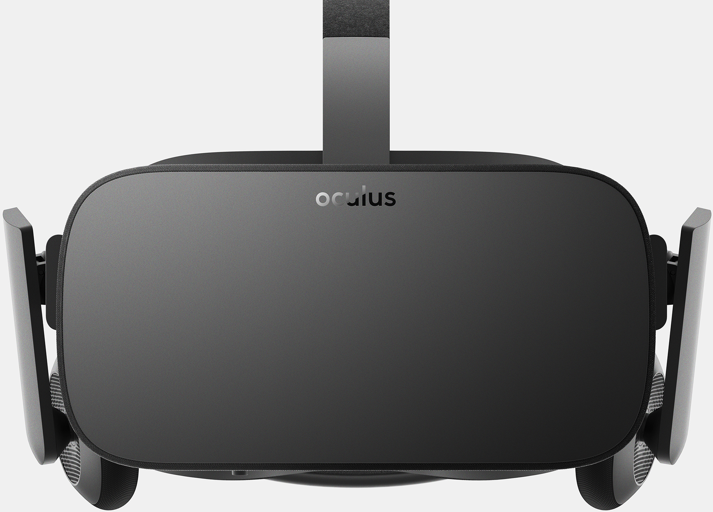

note:
- waarom View Master veel minder overtuigend is dan bv. Oculus Rift
  - ook niet helemaal nieuw eerste toestel dat "compenseerde" in 1968
- ons brein **verwacht** een bepaald effect
  - misselijkheid,... vinden plaats om gelijkaardige reden

---

## Hardware van een VR-systeem

- displays (output)
- sensors (input)
- computers

note:

- displays in de brede zin!

---

## een volledig VR systeem

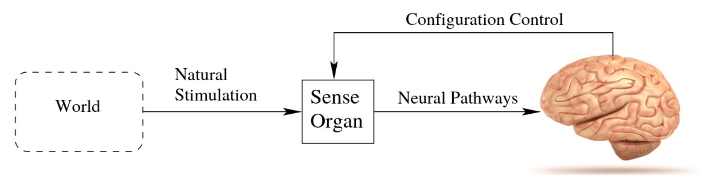
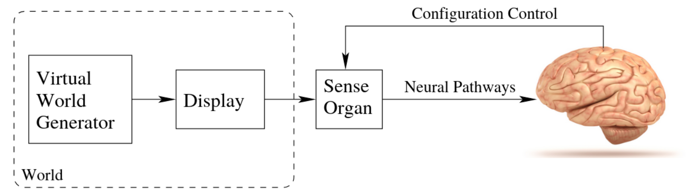

note:
- de VWG is +- de game engine
  - maar we werken niet altijd in een gaming context
  - en gaming engines zijn normaal niet "VR-first"
  - omvat rendering, physics,...

---

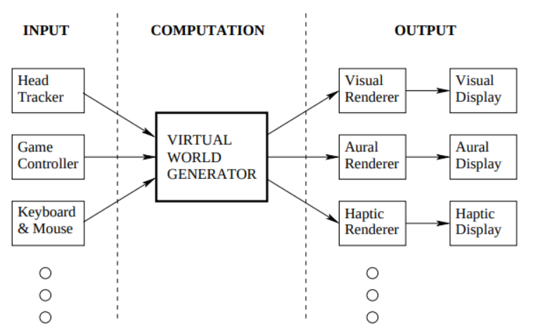

---

## "Onwerkelijke" werkelijkheid

note:

- term VR houdt weinig steek (oxymoron)
  - soms term "virtuality" in de plaats
- realisme is niet altijd het doel en kan de opdracht veel lastiger maken
- focus ligt meestal op visuele werkelijkheid, maar dat is niet de enige

---

## Configuratie zintuigen / sensoren

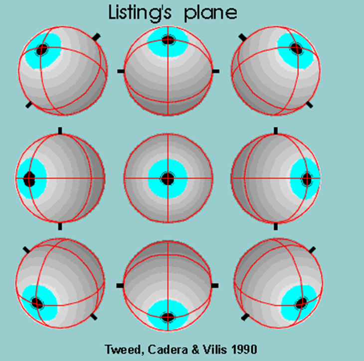

note:

- onze ogen, oren,... kunnen op een bepaalde manier gericht zijn (sommige meer dan andere)
  - bv. oren draaien +- mee met ons hoofd (niet bij pakweg honden)
  - ogen kunnen horizontaal en verticaal (en gecombineerd: diagonaal) draaien
- kan zowel rechtstreeks (ogen rondbewegen) als onrechtstreeks (hoofd bewegen)
  - 3 vrijheidsgraden bovenop 6 van het grotere referentiepunt
  - tracking = configuratie volgens deze vrijheidsgraden opvolgen
    - kan nodig zijn voor illusie (perception of stationarity)
    - kan "nice to have" zijn voor illusie (orkest door koptelefoon terwijl we rondbewegen)
    - kan nuttig zijn voor performance (foveated rendering)

---

## Opdrachten

### Verplicht

- **bekijk** eerste filmpje projectbasis voor **labo 2**
  - overzetten naar C♯ is een goede, optionele oefening

### Aanrader

- lees eerste twee hoofdstukken boek Lavalle tegen **theorieles 2**
