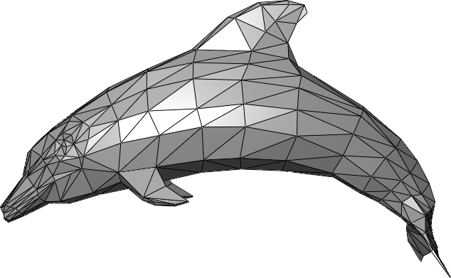
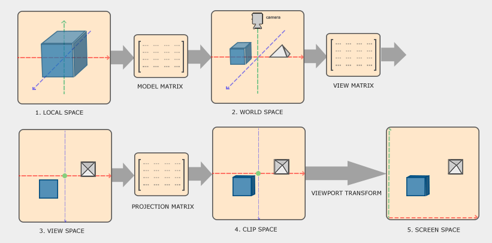
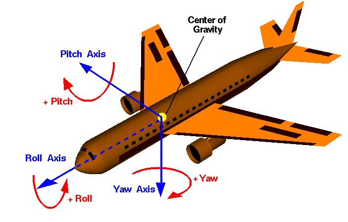
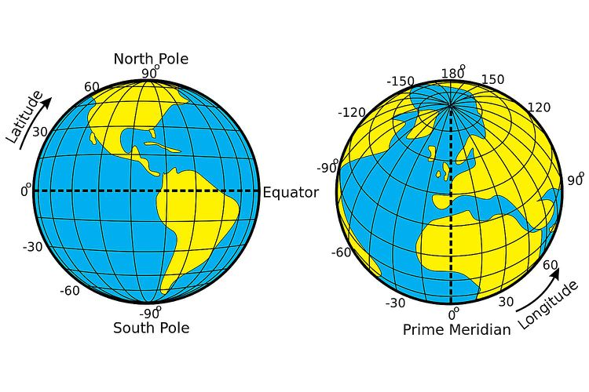
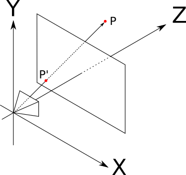
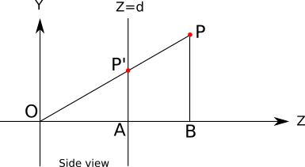

# Meetkundige basis

note:

- opfrissen Maths for IMT, hoofdstuk 1-4 en hoofdstuk 8-9
- reden om dit te doen: graphics produceren = berekenen wat zichtbaar zal zijn
- "meetkundige" basis, niet "wiskundige", want we hebben het (nog) niet over belichting, materialen,...
- minder formules, wel belangrijke stappen en concepten
  - de exacte formules zijn belangrijk wanneer je zaken wil implementeren

---

<iframe width="560" height="315" src="https://www.youtube.com/embed/sW9npZVpiMI?si=pNQirmomXIP6ccKC" title="YouTube video player" frameborder="0" allow="accelerometer; autoplay; clipboard-write; encrypted-media; gyroscope; picture-in-picture; web-share" referrerpolicy="strict-origin-when-cross-origin" allowfullscreen></iframe>

---

## Voorstelling 3D-wereld

- punten in ℝ³ (*vertices*)
  - homogene coördinaten in ℝ⁴
- rechterhandregel

note:

- let op met illustraties, soms linkerhandregel!
- je kan [zelf een rendering engine bouwen](https://gabrielgambetta.com/computer-graphics-from-scratch/) met de concepten

---

## Voorstelling 3D-object



note:

- een verzameling driehoeken
- driehoek is dus groepje van drie punten in ℝ³

---



note:

- nog eens even doorlopen wat de rol van elke stap is, zie maths for IMT

---



note:

- redelijk intuïtief om over te denken
- vertaling naar matrix kan als een "recept"

---



note:

- "probleem" met deze voorstelling is dat op bepaalde punten (noord- en zuidpool) er een vrijheidsgraad "wegvalt"
  - piepkleine beweging kan enorme rotatie
- normaal geven we roll en yaw ook complete range van 2Π radialen / 360°
- pitch range van Π radialen / 180°
- zelfde probleem met pitch tegen limiet: wiskundige abstracties leiden tot problemen omdat vrijheidsgraden gaan samenvallen, waardoor systeem onvoorspelbaar gedrag vertoont
  

---

<iframe width="560" height="315" src="https://www.youtube.com/embed/-7v0OeN7sdI?si=EGcnQfIjhwTtgxM0" title="YouTube video player" frameborder="0" allow="accelerometer; autoplay; clipboard-write; encrypted-media; gyroscope; picture-in-picture; web-share" referrerpolicy="strict-origin-when-cross-origin" allowfullscreen></iframe>

note:

- in FPS,... is het vaak niet mogelijk perfect naar omhoog / beneden te kijken
- in VR *wel*

---

## Quaternions

<iframe width="560" height="315" src="https://www.youtube.com/embed/zjMuIxRvygQ?si=34LInl5HZWFtNS3O" title="YouTube video player" frameborder="0" allow="accelerometer; autoplay; clipboard-write; encrypted-media; gyroscope; picture-in-picture; web-share" referrerpolicy="strict-origin-when-cross-origin" allowfullscreen></iframe>

note:

- zoals complexe getallen, maar twee extra componenten
- een klein stukje hiervan is genoeg (**unit** quaternions, dus a² + b² + c² + d² = 1
  - zoals eenheidscirkel in 2D of eenheidsbol in 3D, maar dan in 4D
  - ook een systeem met 3DOF (als we drie getallen kiezen, ligt het vierde getal vast om de som te doen uitkomen)
  - beelden mooi af op axis-angle rotation, hebben efficiënte voorstelling, leveren meer intuïtieve vorm van interpolatie

---

## Beeldvorming op view plane

note:

- hier moeten we opletten in VR
- eerdere "view space" of "camera space" is voor toepassen perspectief
  - alsof we plakken van de wereld parallel met de richting van de camera naar de camera toe schuiven
  - dit is orthografische projectie, gewoon diepte weggooien
- maar we hebben **twee** camera's in VR, één per oog
  - als we voorlopig één camera veronderstellen (in het midden) spreken we over een "cyclopean" point of view

---

## Een oog in de wereld

note:

- we kunnen een oog behandelen als een object dat we een positie en oriëntatie in de wereld geven (translatie + rotatie)
- maar we willen dat de wereld georiënteerd wordt ten opzichte van het oog
  - dus we bepalen hoe het oog in de wereld zou moeten staan en renderen het niet, maar passen de omgekeerde transformatie toe op de wereld
  - klinkt complex, maar als ik bv. mijn hoofd kwartslag naar links draai, is het alsof de wereld kwartslag naar rechts is gedraaid
  - in boek heet deze transformatie T_eye
- daarna (typisch) perspectiefprojectie
  - andere projectie zoals orthografisch kan maar creëert niet het gevoel van een realistische wereld
- dus we moeten alles maar één keer in world space berekenen, maar wel twee keer in view space, clip space en screen space

---

## Perspectiefprojectie




note:

- kijk even terug naar figuur "clip space"
  - stukken die dichter bij het "oog" zijn, worden meer naar buiten geduwd in ons gezichtsveld
    - komt omdat hoeken uitvergroot worden voor zaken die dichterbij zijn
- we volgen eigenlijk een lijn vanaf een element in de wereld naar het "netvlies" en bekijken wat op het kijkvlak terecht zou komen
  - dit is typisch hoe een "rasterizer" werkt
- "ray tracer": lichtstralen komen ons oog binnen en passeren door "vliegenraam" van pixels
  - we kunnen ze achterwaarts tracen, één straal per pixel, om te zien wat we in elke pixel moeten renderen
  - vertrekt vanaf het oog richting de wereld

---

## Volledige "cyclopean" keten

T_vp * T_can * T_eye * T_rb

note:

- allemaal in de vorm van 4x4-matrices voorgesteld
- rb is "rigid body transform", lees "transformatie naar world space", kan hiërarchie omvatten
- eye is om beeldvorming op view plane, dus +- orthografische projectie met Z-as te bepalen
  - Z-as komt van pas om te achterhalen wat vooraan staat en dus iets anders bedekt
- can is "canonical"
  - omvat toepassing perspectiefprojectie
  - omvat ook omzetting naar normalized device coordinates (NDC)
    - dus waarden tussen -1 en 1 (uiterste waarden horen bij randen van ons kijkvlak)
- vp is de viewport en mapt waarden tussen -1 en 1 op afmetingen scherm
  - bv. -1 wordt pixel 0 en en 1 wordt pixel 1919 in de breedte
  - merk op: als view plane niet zelfde aspect ratio heeft als fysieke scherm, strecht dit het beeld

---

## Stereoscopie


- T_vp * T_can * T_left * T_eye * T_rb
- T_vp * T_can * T_right * T_eye * T_rb

note:

- we vertrekken vanaf "cyclopean" view
- we schuiven de helft van de "IPD" (interpupillary distance) op
  - benadering, maar werkt goed

---

```
1 0 0 t/2
0 1 0 0
0 0 1 0
0 0 0 1
```

---

## Verdere implementatievragen

- ontdubbeling vertices afhandelen?
- driehoek koppelen aan buren?
- binnenkant modelleren?
- curves voorstellen?

note:

1. als twee driehoeken hetzelfde punt bevatten (dus aangrenzend zijn), gaan we dat punt niet meermaals opslaan
2. we slaan onze ruimtelijke data op in een doubly-connected edge list (i.e. dit is wat tools zoals Blender gebruiken), onthoud gewoon datastructuur met pointers
3. doen we normaal niet omdat modellen typisch gesloten zijn
3.1. verklaart waarom je soms "door" een model kan kijken bij ongelukkige camera-oriëntatie, zeker PSX
4. kan (bv. splines), maar gemak op één gebied (bv. een bol modelleren) wordt tegengewerkt door extra complexiteit van operaties
